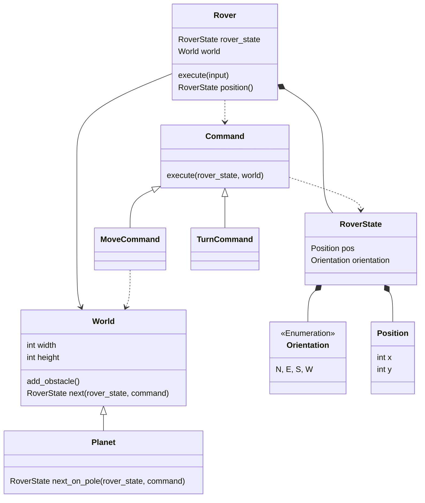

# Mars Rover Kata Solution

see e.g. https://kata-log.rocks/mars-rover-kata

This is my solution of the mars rover kata in python.

I developed it using TDD.

I've implemented both a square World and a Planet with Poles.
Drawing this made it occur to me that this is missing an abstraction for Direction or rather Orientation handling everything that has to do with 'N','E','S','W':

https://mermaid.js.org/syntax/classDiagram.html

## Planet Implementation

-testcases = [
-    T(Planet,12,RS(1,1,"N"), "f", RS(1,2,"N"), ),
-    T(World,12,RS(1,11,"N"), "f", RS(1,0,"N"), xfail=False),
## Crossing the poles

n: number of longitudes 

The longitudes are represented by the x values.
The x value is determined to describe the direction
on the poles; it serves as a history for where the
rover came from.
Without a turn, it moves along the same line - that is
the opposite

new_tests = [pytest.param(*t,marks=pytest.mark.xfail) for t in new_tests]

  N
W   E
  S

0 1 2 3

von oben (N):
  2
3   1
  0 
r: E 1 turns , x + 1
l: W 3 turns , x - 1

von unten (S):
  0
3   1
  2

l: E 1 turns , x + 1
r: W 3 turns , x - 1
